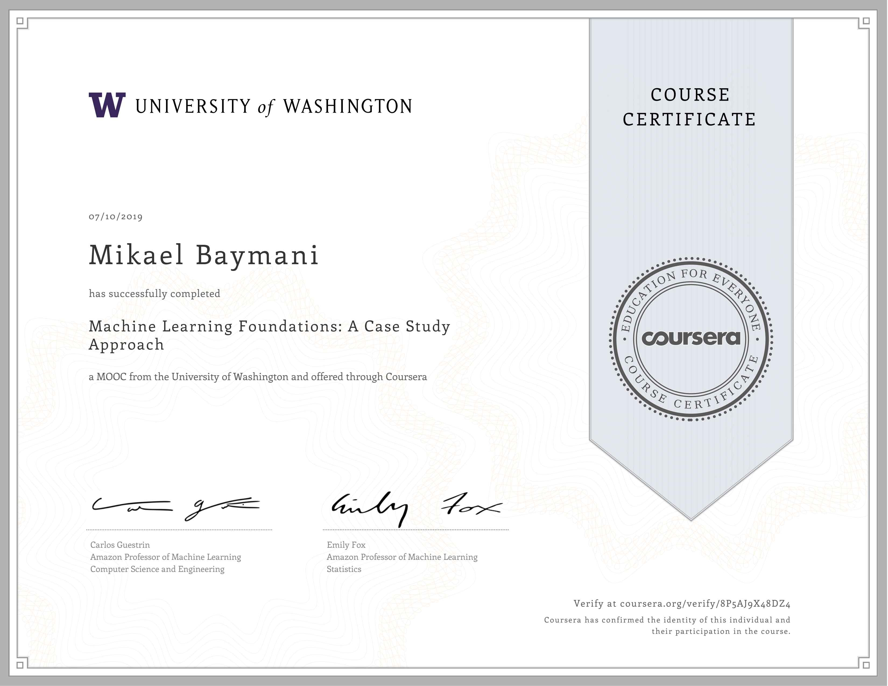
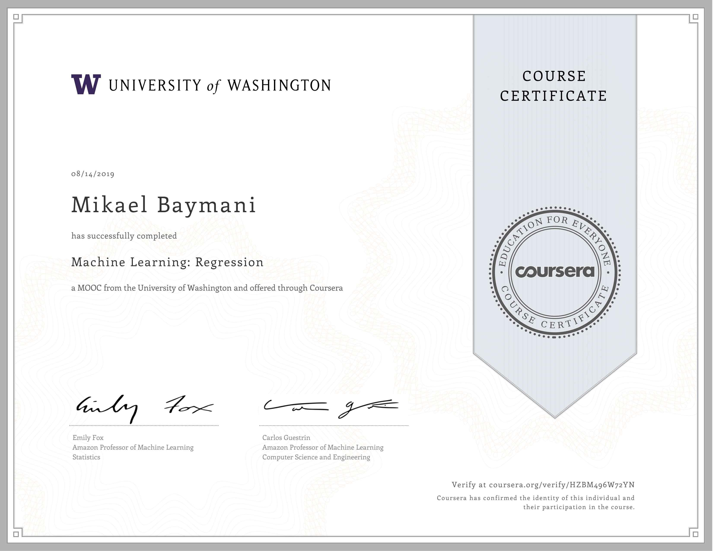

# Machine Learning

## Table of Content
1. [Regression](#regression)
   - [Simple Linear Regression](#simple-linear-regression)
   - [Multiple Linear Regression](#multiple-linear-regression)
   - [Assessing Performance](#assessing-performance)
   - [Ridge Regression](#ridge-regression)
   - [Lasso Regression](#lasso-regression)
   - [Nearest Neighbors & Kernel Regression](#nearest-neighbors-and-kernel-regression)
2. [Classification](#classification)
   - [Linear Classifiers & Logistic Regression](#linear-classifiers-and-logistic-regression)